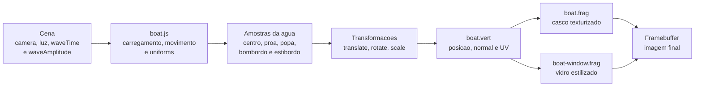
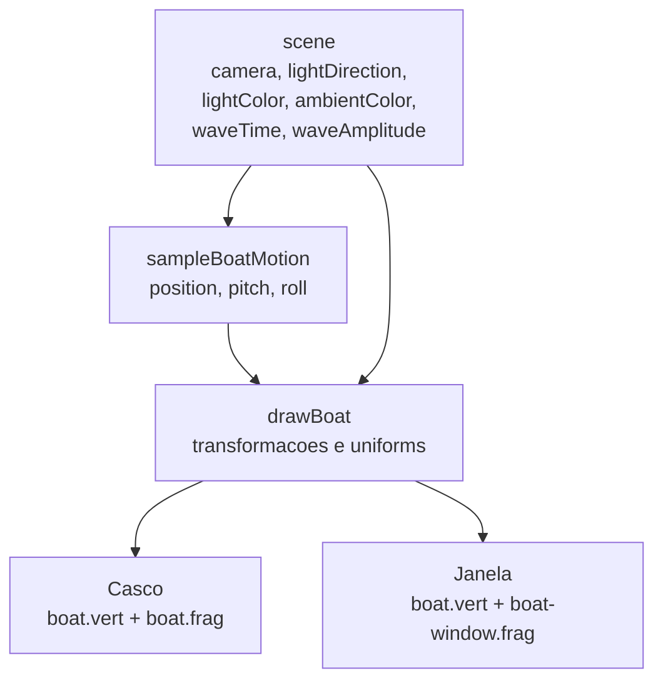
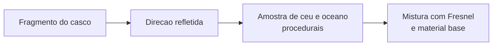

# Renderizacao da Embarcacao, Movimento sobre Ondas e Shaders de Material

## 1. Objetivos

Este material descreve a organizacao atual da embarcacao na cena 3D, sua movimentacao sobre o oceano e os shaders usados para renderizar casco e janelas. Tambem registra a integracao recente com o oceano para recortar a agua na regiao ocupada pelo casco. O foco principal esta nos arquivos `boat.js`, `shaders/boat.vert`, `shaders/boat.frag` e `shaders/boat-window.frag`, com uma secao especifica sobre a comunicacao com `ocean.js` e `shaders/ocean.frag`.

A embarcacao nao simula dinamica naval completa. A proposta atual e acoplar visualmente o barco ao mesmo modelo de ondas usado pelo oceano, de modo que sua altura, pitch e roll acompanhem a superficie da agua em tempo real. O casco usa textura de albedo e iluminacao simples. A janela usa um material azulado, com brilho especular mais concentrado e efeito de Fresnel aproximado.

Ao final, deve ser possivel explicar:

- como o barco e carregado como dois modelos separados, casco e janela;
- como `boat.js` reproduz as ondas de Gerstner no lado da CPU;
- como a altura da embarcacao e obtida a partir da superficie do oceano;
- como amostras na frente, atras, esquerda e direita geram pitch e roll;
- como o vertex shader transforma posicoes, normais e coordenadas UV do OBJ;
- como o fragment shader do casco combina albedo, luz ambiente, difusa e especular;
- como o fragment shader da janela cria vidro estilizado com Fresnel;
- como a silhueta do casco e enviada ao oceano para evitar agua atravessando a embarcacao;
- onde uma etapa futura de controle dinamico de materiais por sliders deve se conectar;
- onde uma etapa futura de ray marching ou ray tracing pode ser inserida sem quebrar a estrutura atual.

> **Estado do projeto:** este documento acompanha a implementacao final atual em `boat.js`, `shaders/boat.vert`, `shaders/boat.frag` e `shaders/boat-window.frag`. O casco possui um controle visivel de `Reflexao` na interface e usa internamente um preset baixo fixo para o efeito refletivo. Ray tracing completo e reflexoes multiplas continuam como extensoes planejadas.

## Sumario

1. [Visao geral da solucao](#2-visao-geral-da-solucao)
2. [Arquivos e responsabilidades](#3-arquivos-e-responsabilidades)
3. [Modelos, transformacoes e materiais](#4-modelos-transformacoes-e-materiais)
4. [Movimento sobre ondas](#5-movimento-sobre-ondas)
5. [Vertex shader compartilhado](#6-vertex-shader-compartilhado)
6. [Shader do casco](#7-shader-do-casco)
7. [Shader da janela](#8-shader-da-janela)
8. [Interfaces e integracao](#9-dados-entre-a-aplicacao-e-os-shaders)
9. [Extensoes futuras de materiais](#10-extensao-futura-controle-dinamico-de-materiais)
10. [Espaco reservado para ray marching ou ray tracing](#11-extensao-futura-ray-marching-ou-ray-tracing)
11. [Validacao, limitacoes e roteiro](#12-estrategia-de-validacao)

## 2. Visao geral da solucao

A embarcacao e desenhada apos a cena fornecer dados compartilhados de iluminacao, camera e tempo das ondas. O arquivo `boat.js` carrega dois shaders e dois modelos OBJ: um para o casco e outro para as janelas. O casco e renderizado com `shaders/boat.frag`; a janela reutiliza o mesmo vertex shader, mas troca o fragment shader para `shaders/boat-window.frag`.

Antes de desenhar os modelos, `drawBoat(scene)` calcula a pose do barco a partir de `sampleBoatMotion(scene.waveTime, scene.waveAmplitude)`. Essa funcao consulta uma versao em JavaScript das mesmas ondas usadas no oceano. O resultado define a translacao vertical, alem das rotacoes de pitch e roll.



A separacao atual segue tres niveis:

| Nivel | Responsavel | Funcao |
| --- | --- | --- |
| Movimento global | `boat.js` | Posiciona e inclina a embarcacao conforme a agua. |
| Geometria do modelo | `boat.vert` | Le vertices, normais e UV do OBJ e projeta para a tela. |
| Aparencia | `boat.frag` e `boat-window.frag` | Calculam cor final do casco e do vidro. |

## 3. Arquivos e responsabilidades

O escopo visual da embarcacao esta concentrado nos shaders e no modulo do barco. A integracao com o oceano tambem usa `ocean.js` e `shaders/ocean.frag` para recortar a agua dentro da silhueta do casco.

| Arquivo | Papel atual |
| --- | --- |
| `boat.js` | Carrega modelos, texturas e shaders; calcula movimento; cria a mascara de footprint; envia uniforms; desenha casco e janela. |
| `shaders/boat.vert` | Vertex shader comum para casco e janela. Transforma posicao e normal para espaco de visao e repassa UV. |
| `shaders/boat.frag` | Fragment shader do casco. Usa textura de albedo, luz ambiente, difusa e especular. |
| `shaders/boat-window.frag` | Fragment shader da janela. Usa cor-base azulada, especular concentrado e Fresnel. |
| `ocean.js` | Envia ao shader do oceano a mascara da silhueta do casco e sua posicao atual na agua. |
| `shaders/ocean.frag` | Descarta fragmentos da agua que caem dentro da mascara do casco. |

O arquivo da janela existente usa hifen no nome: `shaders/boat-window.frag`. Se uma documentacao externa mencionar `boat_window.fra` ou `boat_window.frag`, isso deve ser tratado apenas como variacao de nome. A implementacao atual carrega `shaders/boat-window.frag`.

## 4. Modelos, transformacoes e materiais

### 4.1 Carregamento

`preloadBoat()` executa o carregamento necessario antes do inicio da cena:

```javascript
boatHullShader = loadShader("shaders/boat.vert", "shaders/boat.frag");
boatWindowShader = loadShader("shaders/boat.vert", "shaders/boat-window.frag");

boatHullModel = loadModel("assets/models/mod_boat/body_hull.obj", true);
boatWindowModel = loadModel("assets/models/mod_boat/body_window.obj", true);
boatHullAlbedoTexture = loadImage("assets/models/mod_boat/body_hull_albedo.png");
```

O segundo argumento `true` em `loadModel(...)` normaliza o modelo carregado pelo p5.js. Por isso, as dimensoes finais na cena dependem principalmente de `BOAT_SCALE`, `WINDOW_SCALE` e das transformacoes locais aplicadas em `drawBoat(scene)`.

### 4.2 Transformacao do casco

A posicao base da embarcacao e:

```javascript
const BOAT_POSITION = { x: 0, y: -25, z: 0 };
const BOAT_ROTATION = { x: 0, y: 0, z: Math.PI };
const BOAT_SCALE = 2;
```

Durante o desenho, a posicao calculada pelas ondas e somada ao deslocamento base:

```javascript
translate(
  boatMotion.position.x,
  boatMotion.position.y + BOAT_POSITION.y,
  boatMotion.position.z
);
rotateZ(boatMotion.roll);
rotateX(boatMotion.pitch);
rotateX(BOAT_ROTATION.x);
rotateY(BOAT_ROTATION.y);
rotateZ(BOAT_ROTATION.z);
scale(BOAT_SCALE);
```

A ordem importa. Primeiro o barco e colocado na superficie da agua e inclinado por roll/pitch. Depois sao aplicadas as rotacoes fixas do modelo e a escala final. Assim, a orientacao local do OBJ continua separada do movimento causado pelas ondas.

### 4.3 Transformacao da janela

A janela e desenhada dentro do mesmo `push()` do casco. Portanto, herda a posicao, inclinacao, rotacao e escala da embarcacao. Em seguida recebe uma transformacao local:

```javascript
const WINDOW_POSITION = { x: 0, y: 15, z: 22 };
const WINDOW_ROTATION = { x: 0, y: 0, z: 0 };
const WINDOW_SCALE = 0.34;
```

Essa separacao permite usar um material diferente para a janela sem duplicar a logica de movimento.

## 5. Movimento sobre ondas

### 5.1 Reuso dos parametros do oceano

O barco precisa parecer apoiado na mesma superficie renderizada pelo oceano. Como a malha da agua e deformada no shader, o JavaScript nao consegue consultar diretamente a altura final de cada vertice. A solucao atual e repetir em `boat.js` os mesmos parametros de ondas de Gerstner:

```javascript
const BOAT_WAVES = [
  { direction: { x: 0.9781, z: 0.2079 }, wavelength: 420.0, amplitude: 8.0, steepness: 0.38, phase: 0.0 },
  { direction: { x: 0.9848, z: -0.1736 }, wavelength: 300.0, amplitude: 5.0, steepness: 0.32, phase: 1.1 },
  { direction: { x: 0.8829, z: 0.4695 }, wavelength: 220.0, amplitude: 3.2, steepness: 0.28, phase: 2.4 },
  { direction: { x: 0.9272, z: -0.3746 }, wavelength: 170.0, amplitude: 2.0, steepness: 0.22, phase: 0.7 },
  { direction: { x: 0.8192, z: 0.5736 }, wavelength: 135.0, amplitude: 1.2, steepness: 0.16, phase: 3.2 },
  { direction: { x: 0.8480, z: -0.5299 }, wavelength: 120.0, amplitude: 0.7, steepness: 0.10, phase: 5.1 },
];
```

Essa duplicacao tem uma vantagem pratica: o movimento do barco pode ser calculado antes do desenho dos modelos. A desvantagem e que mudancas futuras nas ondas precisam manter `boat.js` e o shader do oceano sincronizados.

### 5.2 Amostragem da superficie

`sampleOceanSurface(baseX, baseZ, waveTime, waveAmplitude)` avalia a soma de ondas em um ponto horizontal. Para cada onda:

$$
k = \frac{2\pi}{\lambda},
\qquad
\omega = \sqrt{gk},
$$

e a fase e:

$$
\theta = k(D_xx + D_zz) - \omega t + \phi.
$$

O deslocamento segue a mesma ideia de Gerstner:

$$
\begin{aligned}
P_x &= x + Q A D_x\cos(\theta),\\
P_y &= A\sin(\theta),\\
P_z &= z + Q A D_z\cos(\theta).
\end{aligned}
$$

No codigo, a amplitude e multiplicada por `waveAmplitude`, permitindo que o controle global do oceano tambem influencie o barco:

```javascript
const scaledAmplitude = wave.amplitude * waveAmplitude;

positionX += q * scaledAmplitude * wave.direction.x * waveCos;
positionY += scaledAmplitude * waveSin;
positionZ += q * scaledAmplitude * wave.direction.z * waveCos;
```

O retorno inverte o sinal de `y`:

```javascript
return {
  x: positionX,
  y: -positionY,
  z: positionZ,
};
```

Essa inversao mantem coerencia com a convencao usada pela cena p5.js, na qual o eixo vertical visual nao coincide diretamente com o eixo matematico adotado nas equacoes do oceano.

### 5.3 Pitch e roll

O barco nao usa apenas a altura no centro. Ele tambem consulta quatro pontos ao redor:

```javascript
const BOAT_WAVE_SAMPLE = {
  halfLength: 34,
  halfWidth: 16,
};
```

As amostras sao:

| Amostra | Coordenada usada | Finalidade |
| --- | --- | --- |
| Centro | `(x, z)` | Altura e deslocamento principal da embarcacao. |
| Proa | `(x, z + halfLength)` | Comparar frente com tras para pitch. |
| Popa | `(x, z - halfLength)` | Comparar tras com frente para pitch. |
| Bombordo | `(x - halfWidth, z)` | Comparar esquerda com direita para roll. |
| Estibordo | `(x + halfWidth, z)` | Comparar direita com esquerda para roll. |

As inclinacoes sao aproximadas por:

```javascript
const pitch = atan2(stern.y - bow.y, BOAT_WAVE_SAMPLE.halfLength * 2.0);
const roll = atan2(starboard.y - port.y, BOAT_WAVE_SAMPLE.halfWidth * 2.0);
```

Isso equivale a estimar a inclinacao media da agua ao longo do comprimento e da largura virtuais do barco. Esses comprimentos nao alteram a geometria do modelo; apenas controlam o quanto o barco reage a diferencas locais de altura.

> **Erro comum:** usar uma unica amostra de altura para o barco. Isso faz a embarcacao subir e descer, mas nao comunicar que esta apoiada numa superficie inclinada.

## 6. Vertex shader compartilhado

`shaders/boat.vert` e usado tanto pelo casco quanto pela janela. Ele recebe atributos do modelo OBJ:

```glsl
attribute vec3 aPosition;
attribute vec3 aNormal;
attribute vec2 aTexCoord;
```

As matrizes sao fornecidas pelo p5.js:

```glsl
uniform mat4 uModelViewMatrix;
uniform mat4 uProjectionMatrix;
uniform mat3 uNormalMatrix;
```

O shader transforma a posicao para espaco de visao:

```glsl
vec4 positionView = uModelViewMatrix * vec4(aPosition, 1.0);
vPositionView = positionView.xyz;
gl_Position = uProjectionMatrix * positionView;
```

A normal tambem e transformada para espaco de visao:

```glsl
vNormalView = normalize(uNormalMatrix * aNormal);
```

O uso de `uNormalMatrix` e importante porque normais nao devem ser transformadas exatamente como posicoes quando ha escala ou rotacao. A matriz normal preserva a orientacao correta para calculos de iluminacao.

Por fim, as coordenadas UV sao repassadas:

```glsl
vTexCoord = aTexCoord;
```

O casco usa `vTexCoord` para ler a textura de albedo. A janela atualmente nao usa UV, mas pode vir a usa-las em uma versao futura para mascaras, sujeira, rugosidade ou variacao de transparencia.

## 7. Shader do casco

`shaders/boat.frag` renderiza o casco com uma textura de albedo:

```glsl
uniform sampler2D uAlbedoTexture;
vec4 albedoSample = texture2D(uAlbedoTexture, vTexCoord);
```

A iluminacao usa tres vetores em espaco de visao:

```glsl
vec3 normal = normalize(vNormalView);
vec3 lightDirection = normalize(uLightDirectionView);
vec3 viewDirection = normalize(-vPositionView);
vec3 reflectedDirection = reflect(-lightDirection, normal);
```

A componente difusa e Lambertiana:

$$
I_d = \max(\mathbf{N}\cdot\mathbf{L}, 0).
$$

A componente especular usa o reflexo da luz e a direcao da camera:

$$
I_s = \max(\mathbf{V}\cdot\mathbf{R}, 0)^{24}.
$$

No codigo:

```glsl
float diffuseStrength = max(dot(normal, lightDirection), 0.0);
float specularStrength = pow(max(dot(viewDirection, reflectedDirection), 0.0), 24.0);

vec3 ambient = albedoSample.rgb * uAmbientColor;
vec3 diffuse = albedoSample.rgb * uLightColor * diffuseStrength;
vec3 specular = uLightColor * specularStrength * 0.16;

vec3 color = ambient * 0.9 + diffuse + specular;
gl_FragColor = vec4(color, 1.0);
```

Esse modelo e intencionalmente simples. Ele nao possui normal map, roughness, metallic, oclusao ambiente nem conservacao rigorosa de energia. A implementacao atual adiciona ao casco uma camada opcional de reflexao de ambiente: o shader mistura o material base com uma aproximacao procedural do ceu e do oceano, guiada pela direcao refletida da camera. O controle visivel `Reflexao` regula a intensidade dessa mistura, enquanto o custo interno do efeito fica travado em um preset baixo. Com `Reflexao = 0%`, o visual simples original e preservado.

## 8. Shader da janela

`shaders/boat-window.frag` usa os mesmos vetores de iluminacao do casco, mas troca a textura por uma cor-base fixa:

```glsl
vec3 glassBase = vec3(0.16, 0.23, 0.5);
```

O vidro recebe pouca luz difusa:

```glsl
vec3 ambient = glassBase * uAmbientColor * 0.55;
vec3 diffuse = glassBase * uLightColor * diffuseStrength * 0.18;
```

O brilho especular e mais concentrado que o do casco:

```glsl
float specularStrength = pow(max(dot(viewDirection, reflectedDirection), 0.0), 96.0);
vec3 specular = uLightColor * specularStrength * 0.9;
```

Tambem existe um termo de Fresnel aproximado:

```glsl
float fresnel = pow(1.0 - max(dot(normal, viewDirection), 0.0), 2.2);
vec3 edge = uLightColor * fresnel * 0.65;
```

Esse termo aumenta o brilho quando a superficie e vista de forma rasante. A saida possui alfa menor que 1:

```glsl
gl_FragColor = vec4(color, 0.34);
```

O valor alfa expressa a intencao de transparencia, mas a transparencia final tambem depende do estado de blending, ordem de desenho e configuracao WebGL/p5.js. Se a janela precisar de transparencia fisicamente mais consistente, sera necessario validar a ordem de renderizacao e possivelmente separar objetos opacos de objetos transparentes.

## 9. Dados entre a aplicacao e os shaders



As interfaces atuais sao:

| Dado | Origem | Destino | Finalidade |
| --- | --- | --- | --- |
| `scene.waveTime` | Cena principal | `sampleBoatMotion` | Avancar a fase das ondas. |
| `scene.waveAmplitude` | Controle global da agua | `sampleOceanSurface` | Escalar deslocamento do barco junto com o oceano. |
| `scene.camera` | Camera ativa | `worldDirectionToView` | Converter direcao da luz para espaco de visao. |
| `scene.lightDirection` | Skybox/cena | Shaders | Direcao da luz ativa. |
| `scene.lightColor` | Skybox/cena | Shaders | Cor da luz direta. |
| `scene.ambientColor` | Skybox/cena | Shaders | Cor da luz ambiente. |
| `uAlbedoTexture` | `body_hull_albedo.png` | `boat.frag` | Cor-base texturizada do casco. |
| `aPosition/aNormal/aTexCoord` | OBJ carregado | `boat.vert` | Geometria, normais e UV. |

Como os shaders personalizados nao herdam automaticamente todos os calculos de `directionalLight()` e `ambientLight()`, `boat.js` envia a iluminacao explicitamente por uniforms. A funcao `worldDirectionToView(camera, direction)` converte a direcao de luz do mundo para o espaco da camera, garantindo que os produtos escalares do fragment shader usem vetores no mesmo espaco.

Para o casco, a cena tambem envia uniforms extras usados pela reflexao de ambiente:

| Uniform | Origem | Finalidade |
| --- | --- | --- |
| `uSkyTop` | `Skybox.getSkyColors(t).top` | Cor do ceu mais alto na reflexao. |
| `uSkyHorizon` | `Skybox.getSkyColors(t).bot` | Cor da linha do horizonte refletida. |
| `uDarkness` | `Skybox.getDarkness(t)` | Escurecer a agua refletida conforme o ciclo do dia. |
| `uWaveTime` | `scene.waveTime` | Animar os detalhes de onda dentro da reflexao. |
| `uReflectionStrength` | Slider `Reflexao` | Misturar reflexo e albedo do casco. |
| `uRayMarchSteps` | Preset interno fixo | Controlar quantas amostras de detalhe da reflexao sao usadas. |


### 9.1 Mascara de footprint do barco no oceano

A atualizacao mais recente adicionou uma integracao inversa: alem de o barco consultar a agua, o oceano tambem recebe informacoes do barco. O objetivo e evitar que a malha da agua apareca atravessando o casco.

Em `setupBoat()`, `buildBoatFootprintMask()` rasteriza a silhueta do casco vista de cima em um `createGraphics(...)`. Essa textura funciona como uma mascara: branco representa area ocupada pelo barco, preto representa area livre. A mascara e calculada uma vez a partir dos triangulos de `body_hull.obj`.

Os valores `boatFootprintHalfX` e `boatFootprintHalfZ` guardam a meia-extensao da silhueta em unidades de mundo. O fator `BOAT_FOOTPRINT_SHRINK` controla o quanto o recorte fica justo no casco.

Em `drawOcean(scene)`, `setBoatMaskUniforms(scene)` envia para `shaders/ocean.frag`:

| Uniform | Finalidade |
| --- | --- |
| `uBoatFootprintEnabled` | Liga ou desliga o recorte da agua. |
| `uBoatFootprintTex` | Textura da silhueta do casco vista de cima. |
| `uBoatFootprintCenter` | Centro atual do barco na agua, incluindo a deriva horizontal calculada pelas ondas. |
| `uBoatFootprintHalfExtent` | Escala usada para converter posicao XZ do mundo em UV da mascara. |

No fragment shader do oceano, cada fragmento converte sua posicao `vWorldPosition.xz` para coordenadas da mascara. Se o ponto cair dentro da textura e a mascara indicar casco, o fragmento e descartado com `discard`.

Essa solucao nao simula volume de agua nem colisao fisica. Ela e um recorte visual de superficie. Ainda assim, e adequada para esta etapa porque remove a interpenetracao mais visivel entre oceano e embarcacao sem mudar a malha do barco.

## 10. Extensao futura: controle dinamico de materiais

Esta secao registra o controle de material atualmente exposto e a direcao para expansoes futuras. A implementacao atual possui apenas um slider visivel para o casco:

1. `Reflexao`: controla quanto a reflexao de ambiente entra na cor final do casco.
2. `boat.js` envia `uReflectionStrength` e `uRayMarchSteps` para `boat.frag`.
3. `uRayMarchSteps` nao aparece na interface: ele fica fixo internamente em um preset baixo para manter custo previsivel em notebook.
4. `Reflexao = 0%` mantem o material base praticamente sem o efeito refletivo adicional.

Exemplos de uniforms futuros para o casco:

| Uniform futuro | Uso planejado |
| --- | --- |
| `uHullAmbientStrength` | Controlar peso da luz ambiente no casco. |
| `uHullSpecularStrength` | Controlar intensidade especular. |
| `uHullShininess` | Controlar concentracao do brilho. |
| `uHullAlbedoTint` | Tingir a textura sem troca de arquivo. |

Exemplos de uniforms futuros para a janela:

| Uniform futuro | Uso planejado |
| --- | --- |
| `uGlassBaseColor` | Trocar cor azulada do vidro. |
| `uGlassAlpha` | Controlar transparencia pretendida. |
| `uGlassFresnelPower` | Controlar crescimento do brilho em angulo rasante. |
| `uGlassSpecularStrength` | Controlar brilho direto. |
| `uGlassShininess` | Controlar concentracao do highlight. |

Um possivel trecho futuro no fragment shader da janela seria:

```glsl
uniform vec3 uGlassBaseColor;
uniform float uGlassAlpha;
uniform float uGlassFresnelPower;
uniform float uGlassSpecularStrength;
uniform float uGlassShininess;
```

E em `boat.js`:

```javascript
boatWindowShader.setUniform("uGlassBaseColor", glassBaseColor);
boatWindowShader.setUniform("uGlassAlpha", glassAlpha);
boatWindowShader.setUniform("uGlassFresnelPower", glassFresnelPower);
boatWindowShader.setUniform("uGlassSpecularStrength", glassSpecularStrength);
boatWindowShader.setUniform("uGlassShininess", glassShininess);
```

> **Criterio de preservacao:** ao adicionar sliders, os valores iniciais devem reproduzir o resultado atual. Assim, a interface nova nao muda a cena ate o usuario mover um controle.

## 11. Extensao futura: ray marching ou ray tracing

Esta secao descreve a primeira etapa implementada de reflexo no casco e o que permanece como extensao futura. Como o projeto roda em p5.js/WebGL com shaders GLSL ES 1.00, a rota escolhida foi uma reflexao de ambiente procedural no fragment shader do casco, usando um numero fixo e baixo de amostras internas. Isso nao e ray tracing completo da cena.

### 11.1 Onde a extensao entra na estrutura atual

Os pontos de inclusao planejados sao:

| Arquivo | Inclusao futura |
| --- | --- |
| `boat.js` | Enviar novos uniforms: posicao da camera, tempo, parametros de material, limites de marching e possiveis dados simplificados da cena. |
| `shaders/boat.vert` | Repassar posicao de mundo ou posicao de visao com informacao suficiente para construir raios no fragment shader. |
| `shaders/boat.frag` | Aplica a primeira versao de reflexo de ambiente no casco, misturando ceu e oceano procedurais. |
| `shaders/boat-window.frag` | Principal ponto de ray marching/ray tracing para vidro, reflexo e possivel distorcao. |

Atualmente, `boat.vert` envia apenas `vPositionView`, `vNormalView` e `vTexCoord`. Para ray marching, o fragment shader precisara reconstruir um raio. Ha duas opcoes:

1. **Espaco de visao:** manter `vPositionView` e `vNormalView`; calcular `viewDirection = normalize(-vPositionView)` como ja e feito; marchar em um campo definido no espaco de visao.
2. **Espaco de mundo:** adicionar `vPositionWorld`, `vNormalWorld` e `uCameraPosition`; marchar em um campo definido no espaco de mundo.

Para integrar com oceano, skybox e objetos, o espaco de mundo e a opcao mais clara. A alteracao futura exigiria uniforms de matriz/modelo ou uma forma consistente de obter a posicao mundial do vertice antes da camera. Essa decisao deve ser feita junto com a arquitetura geral da cena.

### 11.2 Reflexao de ambiente no casco

A primeira versao implementada trata o casco como uma superficie que reflete uma aproximacao procedural do ambiente, sem tentar intersectar todos os triangulos reais da cena. O fragment shader usa a direcao de reflexao em espaco de visao para consultar duas fontes simplificadas:

1. um gradiente de ceu baseado em `uSkyTop` e `uSkyHorizon`;
2. uma cor de agua procedural, animada por `uWaveTime` e modulada por `uDarkness`.

A forma geral do calculo e:

```glsl
vec3 viewDirection = normalize(-vPositionView);
vec3 reflectedViewRay = reflect(-viewDirection, normal);
vec3 environmentColor = sampleEnvironmentReflection(reflectedViewRay, uRayMarchSteps);
color = mix(color, environmentColor, uReflectionStrength * fresnel);
```

Nesse arranjo, `uRayMarchSteps` nao representa bounces ou reflexoes multiplas. Ele apenas controla quantas amostras internas de detalhe de onda a funcao de reflexao usa. No estado final da interface, esse valor fica fixo em um preset baixo para manter custo baixo e comportamento previsivel.

O fluxo conceitual passa a ser:




### 11.3 Ray tracing completo da cena

Ray tracing completo significaria testar raios contra a geometria do barco, oceano, skybox e demais objetos. Isso nao combina diretamente com o pipeline atual, porque os modelos OBJ sao enviados ao WebGL pelo p5.js e nao estao disponiveis como estruturas de aceleracao dentro do fragment shader.

Para seguir por esse caminho, seriam necessarios recursos adicionais:

- representacao simplificada dos objetos em esferas, planos, caixas ou SDFs;
- textura ou buffer com dados de cena;
- estrutura de aceleracao, mesmo que simples;
- multiplos passes de renderizacao ou renderizacao para textura;
- estrategia para ordenar objetos transparentes.

Por isso, a etapa atual implementa primeiro uma reflexao de ambiente controlada no casco, usando a estrutura de uniforms e varyings ja existente. Reflexoes multiplas, interseccao com geometria real da cena e ray tracing completo continuam fora do escopo imediato.

### 11.4 Relacao com sliders de material

Os sliders futuros podem controlar a ativacao e a intensidade do efeito:

| Controle futuro | Efeito |
| --- | --- |
| `Reflection strength` | Mistura entre material atual e ambiente refletido no casco. |
| `Refraction strength` | Distorcao ou transmissao aproximada no vidro. |
| `Max steps` | Controle futuro caso o preset interno deixe de ser fixo. |
| `Max distance` | Alcance de um marching futuro mais fisico. |
| `Surface epsilon` | Precisao de uma interseccao futura baseada em SDF. |

Esses controles devem ter valores padrao que mantenham o visual atual ou que ativem o efeito de forma sutil. A interface deve deixar claro quando o custo de fragment shader aumenta.

## 12. Estrategia de validacao

### 12.1 Validacao do movimento

1. Desenhar o barco sem ondas e confirmar posicao, escala e orientacao.
2. Ativar apenas a translacao vertical pelo centro da agua.
3. Ativar pitch e conferir se a proa e a popa acompanham cristas e vales.
4. Ativar roll e conferir inclinacao lateral.
5. Comparar movimento do barco com a malha do oceano em diferentes valores de `waveAmplitude`.
6. Testar `waveAmplitude = 0` e confirmar que o barco fica nivelado.
7. Testar amplitudes altas e verificar se a inclinacao nao fica exagerada.

### 12.2 Validacao dos shaders

- Casco com luz frontal: textura visivel, brilho moderado e sem inversao de normal.
- Casco com luz lateral: diferenca clara entre lado iluminado e sombreado.
- Janela em vista frontal: cor azulada e brilho especular controlado.
- Janela em vista rasante: aumento do termo de Fresnel.
- Ciclo dia/noite: `uLightColor` e `uAmbientColor` alteram casco e janela junto com a cena.
- Troca de camera: brilho permanece coerente com a direcao da luz, nao preso a tela.

### 12.3 Validacao futura de materiais e ray marching

- Sliders em valores padrao reproduzem o visual anterior.
- Cada slider altera apenas o material esperado.
- O efeito refletivo pode ser neutralizado com `Reflexao = 0%` sem alterar o restante da renderizacao.
- O preset interno fixo deve manter custo estavel em resolucao comum.
- Reflexos ou distorcoes nao aparecem quando a superficie esta de costas para a camera.

## 13. Limitacoes conhecidas

- O barco nao usa fisica de corpo rigido, massa, inercia, empuxo ou amortecimento.
- A inclinacao e uma aproximacao por quatro amostras, nao uma integracao da area do casco.
- Os parametros das ondas sao duplicados em `boat.js` e precisam acompanhar o oceano.
- O casco usa apenas textura de albedo; mapas de normal, metalicidade e rugosidade ainda nao participam do shader.
- A transparencia da janela depende de estado de blending e ordem de desenho.
- O recorte da agua pelo casco e uma mascara 2D vista de cima; nao e colisao fisica nem volume real.
- O vidro nao reflete a cena real; o Fresnel atual e apenas um termo de brilho.
- A reflexao atual do casco e uma aproximacao procedural de ambiente; nao ha interseccao com a geometria real do oceano ou da skybox, e ray tracing completo continua fora do escopo atual.

Essas limitacoes devem ser apresentadas como escolhas de escopo. A implementacao atual prioriza coerencia visual com a agua e simplicidade de integracao.

## 14. Roteiro sugerido para o seminario

1. Apresentar a embarcacao como dois modelos: casco e janela.
2. Explicar por que o barco precisa consultar a mesma funcao de ondas do oceano.
3. Mostrar a equacao usada em `sampleOceanSurface`.
4. Explicar as cinco amostras: centro, proa, popa, bombordo e estibordo.
5. Relacionar essas amostras com altura, pitch e roll.
6. Percorrer o vertex shader e mostrar posicao, normal e UV.
7. Comparar o material do casco com o material da janela.
8. Explicar o Fresnel simplificado no vidro.
9. Mostrar onde sliders de material entrariam futuramente.
10. Apresentar a reflexao atual do casco como solucao visual leve e deixar ray tracing/ray marching mais fisico como extensao futura.

## 15. Criterio de alinhamento da implementacao

A documentacao e a implementacao estarao alinhadas enquanto as seguintes afirmacoes forem verdadeiras:

- `preloadBoat()` carrega `boat.vert` com dois fragment shaders diferentes.
- `drawBoat(scene)` calcula movimento antes de desenhar os modelos.
- `sampleBoatMotion(...)` usa o centro da agua para posicao e quatro amostras laterais para inclinacao.
- `sampleOceanSurface(...)` usa a mesma familia de ondas de Gerstner do oceano.
- `boat.vert` envia normal e posicao em espaco de visao para os fragment shaders.
- `boat.frag` usa textura de albedo no casco.
- `boat-window.frag` usa cor-base azulada, brilho especular e Fresnel.
- `ocean.js` envia a mascara de footprint do casco para `shaders/ocean.frag`.
- `shaders/ocean.frag` descarta fragmentos de agua dentro da silhueta do casco.
- O casco possui slider visivel de `Reflexao` e usa internamente um preset baixo fixo para o efeito refletivo de ambiente; ray tracing completo e bounces permanecem futuros.
