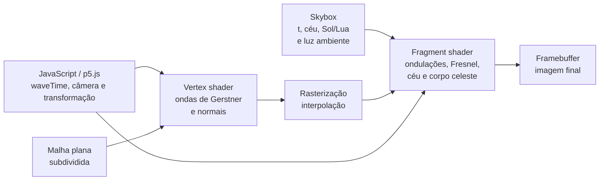
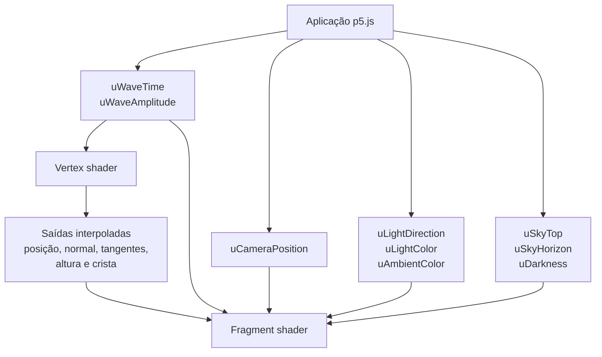

# Renderização de uma Superfície Oceânica com Ondas de Gerstner e Shaders Procedurais

## 1. Objetivos

Este material descreve a metodologia planejada para renderizar a superfície do oceano em uma cena 3D interativa. A proposta combina ondas de Gerstner, calculadas no *vertex shader*, com detalhes procedurais e iluminação calculados no *fragment shader*. O objetivo não é simular toda a dinâmica de fluidos, mas produzir uma aproximação visual coerente, animada e adequada para execução em tempo real no navegador.

Ao final, deve ser possível explicar:

- por que uma superfície plana precisa ser subdividida antes de ser deformada;
- como uma onda de Gerstner altera a posição horizontal e vertical dos vértices;
- como várias ondas formam um mar menos regular;
- como calcular tangentes e normais a partir da função de deslocamento;
- por que detalhes pequenos podem ser adicionados à normal sem criar mais geometria;
- como Fresnel, reflexão do céu e brilho do Sol ou da Lua dão aparência de água;
- quais simplificações separam este método de uma simulação física completa.

> **Estado do projeto:** este documento acompanha a primeira implementação em `ocean.js` e `shaders/ocean.vert`/`ocean.frag`. Os resultados visuais e de desempenho ainda precisam ser medidos em navegadores e máquinas representativos.

## Sumário

1. [Visão geral e escolha da abordagem](#2-visão-geral-da-solução)
2. [Convenções, coordenadas e malha](#4-convenções-e-sistemas-de-coordenadas)
3. [Ondas de Gerstner](#6-uma-onda-de-gerstner)
4. [Tangentes e normais](#8-tangentes-e-normal-analítica)
5. [Detalhe procedural](#9-detalhe-procedural-da-superfície)
6. [Modelo óptico](#10-modelo-óptico-no-fragment-shader)
7. [Interfaces e integração](#11-dados-entre-a-aplicação-e-os-shaders)
8. [Desempenho, validação e limitações](#13-custo-computacional-e-orçamento-inicial)
9. [Roteiro e glossário](#16-roteiro-sugerido-para-o-seminário)

## 2. Visão geral da solução

A cena existente desenha `Skybox.draw(t)`, configura a iluminação compartilhada e reserva a etapa seguinte para o oceano e os demais objetos. O oceano criará uma malha plana uma única vez e receberá da CPU dois conceitos temporais distintos: `waveTime`, em segundos, para a propagação contínua das ondas; e `t`, entre 0 e 1, para o ciclo visual de 05:00 a 21:00. O *vertex shader* transforma a malha em ondas. Depois da rasterização, o *fragment shader* calcula a cor usando a normal da superfície, ruído procedural e o estado luminoso fornecido pelo `Skybox`.



Essa separação segue a escala espacial de cada fenômeno:

| Escala | Representação | Motivo |
| --- | --- | --- |
| Ondas longas e médias | Deslocamento de vértices | Mudam a silhueta e a forma geométrica da superfície. |
| Ondulações pequenas | Perturbação da normal | Alteram a luz, mas não precisam mudar a silhueta à distância. |
| Reflexos e cor | Fragment shader | Dependem da câmera, da luz e da orientação interpolada por pixel. |

## 3. Por que usar uma abordagem híbrida

Há várias formas de representar um oceano. Uma soma de senos verticais é simples, mas produz uma superfície semelhante a um terreno ondulado: os pontos sobem e descem sem o movimento horizontal característico das cristas. Mapas de deslocamento e de normais oferecem detalhe a baixo custo, porém repetem texturas e dependem de recursos externos.

Uma simulação espectral baseada em FFT pode reproduzir estatísticas oceânicas de forma convincente. Em contrapartida, exige texturas de ponto flutuante, múltiplos passos de renderização e troca de *framebuffers*. Esse custo de implementação não é adequado à primeira versão em p5.js. O *ray marching* no fragment shader permite um oceano virtualmente infinito, mas é mais caro por pixel e dificulta a integração com os demais objetos 3D da cena.

As ondas de Gerstner oferecem um meio-termo útil: têm direção, propagação, cristas e deslocamento lateral; são avaliadas diretamente na GPU; e permanecem compatíveis com a malha usada pelos outros elementos da cena. O detalhe procedural complementa as frequências altas que exigiriam subdivisões demais na geometria.

## 4. Convenções e sistemas de coordenadas

Para as equações, será adotado um sistema de mão direita no qual o plano não deformado ocupa os eixos \(x\) e \(z\), e \(y\) aponta para cima. Uma unidade da cena representa um metro e o tempo é medido em segundos:

$$
\mathbf{p}_0 = (x, 0, z).
$$

O p5.js usa, por padrão, um eixo vertical orientado para baixo. A implementação mantém as equações no sistema matemático acima e usa uma função curta `toP5()` no vertex shader para converter \((x,y,z)\) em \((x,-y,z)\). A primeira versão desenha o oceano na origem, sem translação, rotação ou escala p5.js adicional. Como a inversão de \(y\) troca a orientação dos triângulos, a geometria é construída com a ordem de índices correspondente à face superior. Misturar as duas convenções dentro das fórmulas tornaria sinais, produtos vetoriais e iluminação difíceis de verificar.

Quatro espaços precisam permanecer distintos:

- **espaço local:** coordenadas originais e deslocadas da malha do oceano;
- **espaço de mundo:** oceano já posicionado na cena;
- **espaço de visão:** mundo observado pela câmera;
- **espaço de recorte:** resultado usado pela rasterização após a projeção.

As posições são transformadas com coordenadas homogêneas, usando \(w=1\). Direções usam \(w=0\), pois não devem receber translação. Se uma versão futura aplicar transformações de modelo ao oceano, posições e vetores deverão ser convertidos para mundo, e normais deverão usar a matriz inversa transposta.

> **Erro comum:** calcular a luz em espaço de mundo usando uma normal que ainda está em espaço local. Todos os vetores de uma operação de produto escalar precisam estar no mesmo espaço.

## 5. Malha geométrica

O oceano começará como um plano quadrado de \(2400 \times 2400\) metros, dividido em uma grade de \(160 \times 160\) células. Isso resulta em \(161^2 = 25\,921\) vértices e 51.200 triângulos. O maior índice de vértice permanece abaixo de 65.535 e pode ser representado por índices de 16 bits.

A aplicação construirá uma geometria própria no plano local XZ, já em metros, em vez de chamar diretamente `plane(2400, 2400, ...)`. A primitiva `plane()` do p5.js armazena vértices normalizados no plano XY e aplica largura e altura como escala de modelo; isso tornaria os comprimentos de onda incompatíveis com `aPosition` e introduziria escala não uniforme. Na geometria própria, cada posição entregue ao shader já será \((x,0,z)\) no domínio descrito pelas equações.

A subdivisão é indispensável: o vertex shader só move vértices existentes. Um plano formado por apenas dois triângulos continuaria plano, mesmo que seus quatro vértices fossem deslocados. O fragment shader poderia simular iluminação ondulada, mas a silhueta e as interseções com outros objetos permaneceriam retas.

O espaçamento da grade será de \(2400/160=15\) metros. A primeira versão exigirá pelo menos oito segmentos por comprimento de onda; portanto, a menor onda geométrica terá \(\lambda=120\) metros. Ondulações menores serão tratadas apenas como detalhe da normal. Esse limite é mais conservador que o mínimo de Nyquist e preserva a curvatura necessária para a iluminação.

## 6. Uma onda de Gerstner

### 6.1 Parâmetros

Para uma onda \(i\), definimos:

- \(A_i\): amplitude, em unidades da cena;
- \(\lambda_i\): comprimento de onda;
- \(k_i = 2\pi/\lambda_i\): número de onda;
- \(\mathbf{D}_i=(D_{ix},D_{iz})\): direção horizontal unitária;
- \(\omega_i\): frequência angular;
- \(\phi_i\): fase inicial;
- \(Q_i\): fator adimensional de deslocamento horizontal;
- \(s_i\): controle adimensional de inclinação (*steepness*) fornecido pelo autor.

Para águas profundas, a relação de dispersão fornece uma velocidade coerente com o comprimento da onda:

$$
\omega_i = \sqrt{gk_i},
$$

em que \(g=9{,}81\,\text{m}/\text{s}^2\). Ondas longas possuem menor \(k\), mas sua velocidade de fase \(\omega/k\) é maior. Isso evita que todas as frequências se desloquem juntas como uma textura rígida. O uniforme `uWaveTime` será obtido de `millis() / 1000`, sem relação com o parâmetro `t` do ciclo dia/noite e sem um multiplicador temporal oculto; mudanças artísticas de velocidade deverão ser registradas como um parâmetro explícito.

A fase avaliada na posição horizontal \(\mathbf{x}=(x,z)\) e no instante \(t\) é:

$$
\theta_i(\mathbf{x},t)
= k_i(\mathbf{D}_i \cdot \mathbf{x}) - \omega_i t + \phi_i.
$$

O sinal diante do tempo determina o sentido de propagação. Alterá-lo inverte o movimento sem mudar o formato instantâneo da onda.

### 6.2 Deslocamento

Uma onda senoidal comum altera apenas \(y\). A onda de Gerstner também desloca o ponto na direção horizontal da propagação:

$$
\begin{aligned}
P_x &= x + Q_i A_i D_{ix}\cos(\theta_i),\\
P_y &= A_i\sin(\theta_i),\\
P_z &= z + Q_i A_i D_{iz}\cos(\theta_i).
\end{aligned}
$$

Esse movimento descreve uma órbita elíptica para cada ponto da superfície. Ela se torna circular apenas quando os raios horizontal e vertical coincidem, isto é, no caso idealizado \(Q_i=1\). O deslocamento horizontal comprime pontos perto da crista e os afasta perto do vale, produzindo um perfil mais característico da água.

O produto \(Q_i k_i A_i\), e não \(Q_i\) isoladamente, determina a contribuição efetiva para a inclinação. Valores altos criam cristas agudas, mas podem fazer a superfície dobrar sobre si mesma. Para várias ondas, será usado \(s_i\), com \(0 \leq s_i \leq 1\), convertido por:

$$
Q_i = \frac{s_i}{N k_i A_i},
$$

onde \(N\) é o número de ondas. Isso impõe a condição conservadora \(\sum_i Q_i k_i A_i=\sum_i s_i/N\leq1\), reduzindo o risco de auto-interseção. Direções cruzadas tornam o critério geométrico exato mais complexo, portanto a ausência de dobras ainda deverá ser validada visualmente. Deve-se evitar \(A_i=0\) nessa expressão.

## 7. Composição de ondas

Uma única onda é regular demais para representar o mar. Com \(N\) ondas, o ponto deformado será:

$$
\begin{aligned}
P_x &= x + \sum_{i=1}^{N} Q_i A_i D_{ix}\cos(\theta_i),\\
P_y &= \sum_{i=1}^{N} A_i\sin(\theta_i),\\
P_z &= z + \sum_{i=1}^{N} Q_i A_i D_{iz}\cos(\theta_i).
\end{aligned}
$$

As direções não devem ser totalmente aleatórias. Ondas reais costumam possuir uma direção dominante causada pelo vento, acompanhada de componentes cruzadas. Diferenças de comprimento, fase e direção evitam repetição evidente. Os ângulos da tabela são medidos no plano XZ, no sentido anti-horário, partindo de \(+x\) em direção a \(+z\).

Os parâmetros iniciais planejados são:

| Onda | \(\lambda\) | \(A\) | Direção | \(s\) |
| ---: | ---: | ---: | ---: | ---: |
| 1 | 420 | 8,0 | 12° | 0,38 |
| 2 | 300 | 5,0 | −10° | 0,32 |
| 3 | 220 | 3,2 | 28° | 0,28 |
| 4 | 170 | 2,0 | −22° | 0,22 |
| 5 | 135 | 1,2 | 35° | 0,16 |
| 6 | 120 | 0,7 | −32° | 0,10 |

Esses valores são pontos de partida, não resultados calibrados. Todos atendem ao mínimo de oito segmentos por comprimento de onda. As fases iniciais serão constantes determinísticas para que a cena seja reproduzível.

O trecho abaixo omite os parâmetros de tangentes e crista para destacar apenas o deslocamento:

```glsl
void addWave(
  vec2 direction,
  float wavelength,
  float amplitude,
  float steepness,
  float phase,
  vec2 xz,
  inout vec3 displaced
) {
  float k = TWO_PI / wavelength;
  float omega = sqrt(9.81 * k);
  float theta = k * dot(direction, xz) - omega * uWaveTime + phase;
  float Q = steepness / (6.0 * k * amplitude);

  displaced.xz += Q * amplitude * direction * cos(theta);
  displaced.y += amplitude * sin(theta);
}

addWave(vec2(0.9781,  0.2079), 420.0, 8.0, 0.38, 0.0, xz, displaced);
addWave(vec2(0.9848, -0.1736), 300.0, 5.0, 0.32, 1.1, xz, displaced);
addWave(vec2(0.8829,  0.4695), 220.0, 3.2, 0.28, 2.4, xz, displaced);
addWave(vec2(0.9272, -0.3746), 170.0, 2.0, 0.22, 0.7, xz, displaced);
addWave(vec2(0.8192,  0.5736), 135.0, 1.2, 0.16, 3.2, xz, displaced);
addWave(vec2(0.8480, -0.5299), 120.0, 0.7, 0.10, 5.1, xz, displaced);
```

No shader completo, a mesma função recebe parâmetros `inout` adicionais e acumula as derivadas de \(\mathbf{T}_x\), \(\mathbf{T}_z\) e a intensidade da crista. As chamadas explícitas são intencionais para manter compatibilidade previsível com compiladores GLSL ES 1.00.

> **Interpretação visual:** amplitude aumenta a altura; comprimento aumenta a distância entre cristas; direção muda o fluxo aparente; inclinação concentra a forma perto das cristas; fase altera apenas o ponto inicial do ciclo.

## 8. Tangentes e normal analítica

Iluminar o plano com sua normal original \((0,1,0)\) faria a geometria se mover sem que a luz acompanhasse sua curvatura. A normal deve ser derivada da mesma função usada no deslocamento.

Definimos duas tangentes por derivação em relação às coordenadas originais:

$$
\mathbf{T}_x = \frac{\partial \mathbf{P}}{\partial x},
\qquad
\mathbf{T}_z = \frac{\partial \mathbf{P}}{\partial z}.
$$

Como

$$
\frac{\partial \theta_i}{\partial x}=k_iD_{ix},
\qquad
\frac{\partial \theta_i}{\partial z}=k_iD_{iz},
$$

as componentes de \(\mathbf{T}_x\) são:

$$
\begin{aligned}
\frac{\partial P_x}{\partial x}
&=1-\sum_i Q_iA_ik_iD_{ix}^2\sin(\theta_i),\\
\frac{\partial P_y}{\partial x}
&=\sum_i A_ik_iD_{ix}\cos(\theta_i),\\
\frac{\partial P_z}{\partial x}
&=-\sum_i Q_iA_ik_iD_{ix}D_{iz}\sin(\theta_i).
\end{aligned}
$$

Para \(\mathbf{T}_z\):

$$
\begin{aligned}
\frac{\partial P_x}{\partial z}
&=-\sum_i Q_iA_ik_iD_{ix}D_{iz}\sin(\theta_i),\\
\frac{\partial P_y}{\partial z}
&=\sum_i A_ik_iD_{iz}\cos(\theta_i),\\
\frac{\partial P_z}{\partial z}
&=1-\sum_i Q_iA_ik_iD_{iz}^2\sin(\theta_i).
\end{aligned}
$$

No plano não deformado, \(\mathbf{T}_x=(1,0,0)\) e \(\mathbf{T}_z=(0,0,1)\). Para obter uma normal apontando para cima nessa convenção, usamos:

$$
\mathbf{N}=\operatorname{normalize}(\mathbf{T}_z\times\mathbf{T}_x).
$$

A ordem do produto vetorial importa: invertê-la produz uma normal voltada para baixo. O vertex shader transformará \(\mathbf{T}_x\), \(\mathbf{T}_z\) e \(\mathbf{N}\) para o espaço de mundo. Os três vetores serão enviados ao fragment shader, pois o detalhe procedural precisa de uma base tangente, não apenas da normal.

```glsl
vec3 normalLocal = normalize(cross(tangentZ, tangentX));
vec3 normalWorld = normalize(toP5(normalLocal));
vec3 tangentXWorld = normalize(toP5(tangentX));
vec3 tangentZWorld = normalize(toP5(tangentZ));
```

Essa conversão direta é válida porque a malha permanece na origem e não recebe uma transformação de modelo adicional. A projeção final usa `uModelViewMatrix` e `uProjectionMatrix`, fornecidas automaticamente pelo p5.js.

Após a rasterização, todos os vetores interpolados perdem comprimento unitário. O fragment shader deverá normalizar novamente a normal e reconstruir uma base ortonormal por Gram–Schmidt:

```glsl
vec3 N = normalize(vNormalWorld);
vec3 T = normalize(vTangentXWorld - N * dot(N, vTangentXWorld));
vec3 B = normalize(cross(T, N));

if (dot(B, vTangentZWorld) < 0.0) {
  B = -B;
}
```

> **Erro comum:** deslocar o vértice com uma função e aproximar a normal com outra. A diferença aparece como reflexos que não acompanham as cristas.

## 9. Detalhe procedural da superfície

As seis ondas cobrem formas que alteram a geometria. Ondulações menores serão calculadas no fragment shader por meio de ruído procedural. Isso acrescenta variação por pixel sem multiplicar a quantidade de vértices.

### 9.1 Ruído de valor

O ruído de valor associa números pseudoaleatórios aos vértices de uma grade. Para uma posição contínua, os valores vizinhos serão interpolados com a curva quíntica:

$$
f(u)=6u^5-15u^4+10u^3,
\qquad
f'(u)=30u^2(u-1)^2.
$$

A função de *hash* deve ser determinística: a mesma coordenada sempre retorna o mesmo valor. Ela não precisa ser criptograficamente aleatória; precisa apenas evitar padrões visíveis. Para GLSL ES 1.00, será implementada apenas com operações de ponto flutuante como `dot`, `sin` e `fract`, sem inteiros sem sinal ou operações de bits. A curva quíntica possui primeira e segunda derivadas contínuas nas bordas das células, reduzindo marcas na normal calculada.

Se \(r_{00},r_{10},r_{01},r_{11}\) são os valores pseudoaleatórios dos quatro cantos, \(s=f(u)\) e \(t=f(v)\), o ruído interpolado é:

$$
n(u,v)=(1-t)[(1-s)r_{00}+sr_{10}]
+t[(1-s)r_{01}+sr_{11}].
$$

Suas derivadas locais podem ser calculadas sem novas chamadas de *hash*:

$$
\begin{aligned}
\frac{\partial n}{\partial u}
&=f'(u)[(1-t)(r_{10}-r_{00})+t(r_{11}-r_{01})],\\
\frac{\partial n}{\partial v}
&=f'(v)[(1-s)(r_{01}-r_{00})+s(r_{11}-r_{10})].
\end{aligned}
$$

### 9.2 Movimento browniano fracionário

O fBm soma oitavas de ruído com frequências crescentes e amplitudes decrescentes:

$$
h(\mathbf{x},t)
=\sum_{j=0}^{M-1} a_0p^j
\,n\!\left(f_0l^j\mathbf{x}+\mathbf{v}_jt\right),
$$

onde \(M\) é o número de oitavas, \(p\) é a persistência, \(l\) é a lacunaridade e \(\mathbf{v}_j\) controla a animação. Serão usadas três oitavas, amplitude inicial \(a_0=0{,}5\) metro, frequência inicial \(f_0=1/30\,\text{m}^{-1}\), lacunaridade \(l=2\) e persistência \(p=0{,}5\). As escalas características serão, portanto, 30, 15 e 7,5 metros. Direções de movimento ligeiramente diferentes reduzem a aparência de uma textura deslizando rigidamente.

Em vez de diferenças finitas, cada avaliação calcula diretamente as duas derivadas analíticas necessárias. As derivadas são obtidas durante a interpolação dos quatro valores da célula usando \(f'(u)\). Pela regra da cadeia, o gradiente do fBm é:

$$
\nabla h(\mathbf{x},t)
=\sum_{j=0}^{M-1}a_0p^j f_0l^j
\,\nabla n\!\left(f_0l^j\mathbf{x}+\mathbf{v}_jt\right).
$$

Assim, três oitavas exigem três avaliações completas de ruído, em vez das doze avaliações necessárias para diferenças centrais em dois eixos. Usando a base tangente ortonormal \((\mathbf{T},\mathbf{B},\mathbf{N})\), a normal perturbada é:

$$
\mathbf{N}'=
\operatorname{normalize}\left(
\mathbf{N}
-\beta\frac{\partial h}{\partial x}\mathbf{T}
-\beta\frac{\partial h}{\partial z}\mathbf{B}
\right),
$$

onde \(\beta=1\) mantém o gradiente nas unidades físicas definidas acima. Se a intensidade precisar de ajuste artístico, \(\beta\) será alterado explicitamente. A perturbação deverá permanecer sutil: detalhes de alta frequência dominantes fazem o oceano parecer metal áspero.

Frequências menores que um pixel provocam cintilação. Como a implementação usará GLSL ES 1.00 sem depender da extensão `OES_standard_derivatives`, cada oitava será atenuada por distância até a câmera. As três escalas de 30, 15 e 7,5 metros desaparecerão progressivamente nos intervalos de 800–1400, 350–700 e 150–350 metros, respectivamente:

```glsl
float fadeByDistance(float distanceToCamera, float fadeStart, float fadeEnd) {
  return 1.0 - smoothstep(fadeStart, fadeEnd, distanceToCamera);
}
```

Esse filtro não mede diretamente o tamanho do fragmento, mas funciona como um nível de detalhe contínuo e portátil em WebGL1. Ele preserva ondulações perto da câmera e remove as frequências mais propensas a cintilar à distância. Os limiares deverão ser validados com a câmera real da cena.

> **Impacto no desempenho:** cada oitava ainda é executada por fragmento. Três avaliações com gradiente analítico são o orçamento inicial; aumentar a grade geométrica não reduz esse custo.

## 10. Modelo óptico no fragment shader

### 10.1 Vetores fundamentais

No ponto de superfície, definimos vetores normalizados:

- \(\mathbf{N}\): normal perturbada;
- \(\mathbf{V}\): direção do ponto para a câmera;
- \(\mathbf{L}\): direção do ponto para o corpo celeste ativo;
- \(\mathbf{R}=\operatorname{reflect}(-\mathbf{V},\mathbf{N})\): direção refletida.

Todos serão avaliados no espaço de mundo do p5.js. Durante o dia, \(\mathbf{L}\) será `Skybox.getSunDir(t)`; quando `Skybox.getSunElevation(t) <= 0`, será `Skybox.getMoonDir(t)`. Essas funções já retornam a direção da origem para o corpo celeste com \(y\) negativo acima do horizonte, portanto o shader não inverterá o vetor. A inversão usada por `directionalLight(..., -dir.x, -dir.y, -dir.z)` pertence à convenção específica dessa função do p5.js. O produto \(\mathbf{N}\cdot\mathbf{V}\) informa quão rasante é a observação; \(\mathbf{R}\) seleciona a região do céu refletida pela água.

### 10.2 Fresnel de Schlick

A água reflete pouco quando observada de cima e muito quando observada em ângulo rasante. Para ar com índice \(n_1\approx1\) e água com \(n_2\approx1{,}333\), a refletância normal é:

$$
F_0=\left(\frac{n_1-n_2}{n_1+n_2}\right)^2
\approx0{,}0204.
$$

A aproximação de Schlick calcula a refletância para outros ângulos:

$$
F(\mathbf{N},\mathbf{V})
=F_0+(1-F_0)
\left(1-\max(\mathbf{N}\cdot\mathbf{V},0)\right)^5.
$$

Mesmo com \(F_0\) pequeno, o termo de quinta potência faz \(F\) se aproximar de 1 no horizonte. Esse comportamento é essencial para a leitura visual da água.

### 10.3 Céu compartilhado e brilho celeste

Na primeira versão não há um mapa de ambiente. A cor refletida é obtida da mesma paleta interpolada usada pela cúpula existente. Para não acessar o método privado `Skybox._sky(t)`, o método público `Skybox.getSkyColors(t)` retorna `{ top, bot }`. Esses valores são normalizados de 0–255 para 0–1 e enviados como `uSkyTop` e `uSkyHorizon`.

O shader selecionará a cor pela componente vertical de \(\mathbf{R}\), respeitando que o alto da cena p5.js possui \(y<0\). Direções refletidas abaixo do horizonte serão limitadas à cor do horizonte, evitando um céu invertido. Uma contribuição concentrada para o Sol ou a Lua será calculada por:

$$
S=\max(\mathbf{R}\cdot\mathbf{L},0)^m,
$$

em que um expoente \(m\) alto cria um brilho pequeno e intenso. Uma segunda potência menos concentrada pode formar o halo. Como a normal inclui ondas e ruído, o reflexo se fragmenta naturalmente sobre a superfície. O termo celeste só será aceito quando \(\mathbf{N}\cdot\mathbf{L}>0\) e \(\mathbf{N}\cdot\mathbf{V}>0\). A cor virá de `Skybox.getLightColor(t)` e a intensidade ambiente de `Skybox.getAmbientColor(t)`, ambas normalizadas para 0–1.

### 10.4 Cor transmitida aproximada

Sem uma cena renderizada abaixo do oceano, não é possível calcular refração ou profundidade óptica reais. Será usada uma cor-base que varia entre azul profundo e turquesa conforme a altura da onda, sua orientação e a distância da câmera. Essa é uma aproximação artística, não uma aplicação completa da lei de Beer–Lambert.

A composição inicial incluirá o corpo celeste dentro da parcela refletida:

$$
\mathbf{C}
=(1-F)\mathbf{C}_{\text{água}}
+F\left[
\mathbf{C}_{\text{céu}}(\mathbf{R})
+\chi\mathbf{C}_{\text{celeste}}S
\right],
$$

onde \(\chi\) vale 1 apenas quando o corpo celeste e a câmera estão acima da superfície local. Multiplicar toda a parcela de ambiente por \(F\) mantém o brilho especular coerente com a refletância da água. Uma pequena contribuição de espalhamento, modulada pela cor ambiente do `Skybox`, impede que regiões não refletivas fiquem totalmente escuras; ela não será descrita como reflexão difusa física. O brilho das cristas poderá usar altura e inclinação como máscara suave, mas não deverá ser chamado de espuma: espuma real depende de quebra, curvatura, persistência e advecção.

### 10.5 Tonemapping e gama

Os cálculos de luz serão feitos em espaço linear. Como as paletas atuais do `Skybox` estão armazenadas como cores de exibição em 0–255, o fragment shader converterá os uniformes normalizados com `pow(color, vec3(2.2))` antes da iluminação. Antes da saída, uma curva simples de Reinhard limita valores intensos:

$$
\mathbf{C}_{\text{map}}=
\frac{\mathbf{C}}{\mathbf{1}+\mathbf{C}}.
$$

Em seguida, uma aproximação de conversão para sRGB será aplicada:

$$
\mathbf{C}_{\text{saída}}
=\mathbf{C}_{\text{map}}^{1/2.2}.
$$

Aplicar gama antes de somar as luzes produz contrastes incorretos. O shader escreverá a cor final corrigida diretamente em `gl_FragColor`; nenhuma segunda correção será feita pelo JavaScript.

## 11. Dados entre a aplicação e os shaders

### 11.1 Versão da API gráfica

A implementação será feita inteiramente com as APIs do p5.js 1.11.13. A aplicação usará `p5.Geometry` para armazenar a grade, `loadShader()`/`p5.Shader` para carregar os programas, `shader()` e `setUniform()` para desenhar, e `model()` para enviar a geometria. Não será introduzido outro motor 3D nem código direto de criação de buffers ou programas WebGL.

Os shaders usarão GLSL ES 1.00. Como o p5.js atual solicita WebGL2 por padrão, `setup()` deverá chamar `setAttributes("version", 1)` antes de `createCanvas(...)`. Os shaders não terão diretiva `#version`; usarão `attribute`, `varying`, `texture2D` quando necessário e `gl_FragColor`. Tanto o vertex quanto o fragment shader declararão `precision highp float`, necessária para avaliar ruído em uma superfície de 2400 metros.

Os arquivos de shader continuarão sendo recursos do sketch p5.js e serão carregados no ciclo de vida padrão:

```javascript
function preload() {
  preloadOcean(); // internamente usa loadShader(vertPath, fragPath)
}

function setup() {
  setAttributes("version", 1);
  const canvas = createCanvas(windowWidth, windowHeight, WEBGL);
  // restante da inicialização existente
}
```

O arquivo `ocean.js` expõe apenas as funções globais `preloadOcean()`, `setupOcean()` e `drawOcean(scene)`. Essa organização acompanha o ciclo de vida do p5.js sem introduzir uma classe ou hierarquia desnecessária.

GLSL ES 1.00 possui restrições de inicialização e indexação de arrays. As seis ondas são aplicadas por seis chamadas explícitas a uma função `addWave(...)`, em vez de arrays constantes indexados por um laço. As matrizes internas utilizadas são `uModelViewMatrix` e `uProjectionMatrix`. A posição é convertida para os eixos p5.js antes da projeção:

```glsl
vec3 worldPosition = toP5(displacedLocal);
gl_Position = uProjectionMatrix * uModelViewMatrix * vec4(worldPosition, 1.0);
```

### 11.2 Interface de dados



As interfaces planejadas são:

| Dado | Origem | Destino | Finalidade |
| --- | --- | --- | --- |
| `uWaveTime` | `millis() / 1000` | Ambos | Propagar ondas e animar ruído independentemente de `t`. |
| `uWaveAmplitude` | Controle de amplitude, de 0 a 2 | Ambos | Escalar o deslocamento, as tangentes, as cristas e as ondulações procedurais. |
| `uCameraPosition` | `sceneCamera.eyeX/Y/Z` | Fragment | Calcular \(\mathbf{V}\), Fresnel e nível de detalhe. |
| `uLightDirection` | `Skybox.getLightDir(t)` | Fragment | Direção até o corpo celeste ativo. |
| `uLightColor` | `Skybox.getLightColor(t)` | Fragment | Cor e intensidade do Sol ou da Lua. |
| `uAmbientColor` | `Skybox.getAmbientColor(t)` | Fragment | Espalhamento aproximado na água. |
| `uSkyTop/uSkyHorizon` | `Skybox.getSkyColors(t)` | Fragment | Reflexo coerente com a cúpula visível. |
| `uDarkness` | `Skybox.getDarkness(t)` | Fragment | Ajustar contraste e cor noturna. |
| Matrizes de visão/projeção | p5.js | Vertex | Projetar a posição de mundo. |
| Posição de mundo | Vertex | Fragment | Ruído, câmera e iluminação. |
| Normal de mundo | Vertex | Fragment | Base para a normal detalhada. |
| Tangentes de mundo | Vertex | Fragment | Construir a base para o gradiente procedural. |
| Altura/inclinação | Vertex | Fragment | Variação cromática e cristas. |

Os parâmetros relativos das seis ondas ficam como literais nas seis chamadas de `addWave` do vertex shader. Isso evita arrays pouco portáveis em GLSL ES 1.00. O controle de interface altera apenas `uWaveAmplitude`, um multiplicador comum que preserva as proporções entre as ondas. O intervalo de 0% a 200% permite comparar uma superfície plana, a configuração original e ondas com o dobro do deslocamento.

As saídas serão empacotadas em cinco vetores `varying`: posição, normal, tangente X, tangente Z e um `vec2` com altura e intensidade de crista. Isso permanece dentro do mínimo de oito vetores `vec4` garantido por WebGL1. Todos serão renormalizados ou reinterpretados no fragment shader após a interpolação.

## 12. Integração com os demais elementos da cena

O oceano será inserido no ponto reservado na etapa 3 de `draw()`, depois de `Skybox.draw(t)` e da configuração das luzes p5.js. Como um `p5.Shader` personalizado não herda automaticamente os cálculos de `directionalLight()` e `ambientLight()`, os mesmos dados serão enviados explicitamente pelos uniformes descritos acima. As chamadas de luz existentes continuarão atendendo aos outros objetos e materiais da cena.

Atualmente, `index.js` combina `Skybox.getLightColor(t)`, que troca para luar à noite, sempre com `Skybox.getSunDir(t)`. Na integração, a direção usada por `directionalLight()` também deverá escolher `getMoonDir(t)` quando a elevação solar for menor ou igual a zero. O shader e os materiais p5.js compartilharão exatamente o mesmo vetor ativo.

O `orbitControl()` existente continuará responsável pela interação. Durante `setup()`, a aplicação armazenará a câmera ativa em `sceneCamera` para que sua posição atualizada possa ser enviada ao shader a cada quadro. O oceano não criará um segundo controle de câmera.

O parâmetro global `t` pertence exclusivamente ao ciclo dia/noite. Pausar ou arrastar o controle de horário não pausa as ondas, pois `uWaveTime` é derivado separadamente de `millis()`. O método público `getSkyColors(t)` compartilha as cores sem expor `_sky(t)`.

O controle “Amplitude” atualiza `uWaveAmplitude` durante a animação e mostra o valor em porcentagem. O valor inicial de 100% reproduz as amplitudes da tabela da Seção 7; 0% remove o deslocamento geométrico, as ondulações procedurais e a contribuição cromática das cristas.

O oceano será desenhado dentro de `push()`/`pop()`, aplicando `shader(oceanShader)` e `model(oceanGeometry)`. Depois dele, `resetShader()` evitará que o shader da água afete objetos desenhados por outros integrantes. O raio atual da cúpula é 1900; a metade da diagonal do plano oceânico é aproximadamente 1697 metros, portanto a grade de 2400 metros permanece dentro do céu. A posição da cena deverá preservar essa relação.

Objetos próximos à água exigirão decisões posteriores:

- reflexão de objetos requer uma renderização adicional da cena ou reflexão em espaço de tela;
- refração requer uma textura da cena abaixo da superfície e dados de profundidade;
- interseções com barcos ou rochas precisam de espuma, deslocamento local ou partículas;
- sombras sobre a água dependem de mapas de sombra compartilhados pela cena.

Esses recursos não fazem parte da primeira implementação, mas a interface em espaço de mundo evita bloquear sua inclusão futura.

## 13. Custo computacional e orçamento inicial

O custo do vertex shader cresce com o número de vértices multiplicado pelo número de ondas. Com aproximadamente 26 mil vértices e seis ondas, a carga geométrica deve ser confortável em notebooks modernos. O custo do fragment shader cresce com a quantidade de pixels, amostras de ruído e operações de iluminação; em tela cheia, ele provavelmente será o estágio dominante.

Decisões iniciais para desempenho equilibrado:

- limitar a densidade de pixels a no máximo 2;
- usar seis ondas com chamadas explícitas a uma função comum;
- usar três oitavas de fBm;
- evitar texturas e passos adicionais de framebuffer;
- não calcular sombras, refração nem reflexão planar;
- reduzir primeiro as oitavas e a densidade de pixels caso o desempenho seja insuficiente.

O plano não é realmente infinito. Seu tamanho e a câmera deverão ocultar as bordas abaixo ou além do horizonte. Uma solução futura poderá reposicionar a malha em torno da câmera ou usar anéis com níveis de detalhe.

## 14. Estratégia de validação

### 14.1 Validação isolada

1. Renderizar a grade sem deslocamento e confirmar orientação, câmera e projeção.
2. Confirmar que a grade mede 2400 metros e que a menor onda ocupa oito células.
3. Ativar uma única onda e comparar crista, vale e direção com a equação.
4. Exibir normais e tangentes como cores RGB para verificar continuidade, orientação e mudança de eixos.
5. Ativar as seis ondas sem detalhe procedural.
6. Adicionar ruído apenas à normal e confirmar que a silhueta não muda.
7. Afastar a câmera e confirmar que a atenuação por distância remove cintilação das oitavas menores.
8. Introduzir Fresnel, céu, Sol e cor-base em etapas separadas.

### 14.2 Casos visuais

- Vista superior: pouca reflexão e leitura clara das formas geométricas.
- Vista rasante: reflexão do céu mais intensa por Fresnel.
- Câmera em movimento: brilho do corpo celeste estável no mundo, não preso à tela.
- Sol ou Lua atrás da superfície: ausência de brilho especular inválido.
- Ciclo completo: reflexo, corpo celeste, luz ambiente e tonalidade da água acompanham `t`.
- Controle de horário pausado: céu para, mas `uWaveTime` e as ondas continuam avançando.
- Controle de amplitude: 0% produz uma superfície plana, 100% preserva os valores originais e 200% duplica o deslocamento sem erros no console.
- Redimensionamento: perspectiva, resolução e canvas atualizados.
- Longa execução: ausência de saltos, cintilação excessiva ou perda perceptível de precisão.
- Contexto WebGL1: shaders GLSL ES 1.00 compilam sem erros e a cúpula existente permanece visível.

### 14.3 Desempenho

O objetivo inicial é animação visualmente contínua em um notebook comum. A medição deverá registrar resolução, densidade de pixels e taxa de quadros. Se houver queda, os parâmetros serão reduzidos nesta ordem: densidade de pixels, oitavas de ruído e número de ondas. A malha só poderá perder subdivisões se os menores comprimentos geométricos também forem removidos ou aumentados, preservando o mínimo de oito células por onda.

## 15. Limitações conhecidas

- Gerstner descreve uma superfície paramétrica, não resolve as equações completas de fluidos.
- Não há interação dinâmica entre ondas e objetos.
- O céu refletido reutiliza a paleta do `Skybox`, mas não inclui estrelas, discos geométricos nem outros objetos da cena.
- A cor profunda é uma aproximação sem espessura óptica real.
- A perturbação procedural da normal não altera sombra nem silhueta.
- Não há espuma persistente, refração, cáusticas ou sombras na primeira versão.
- Uma malha finita pode revelar suas bordas em câmeras inadequadas.

Essas limitações devem ser apresentadas no seminário. Realismo gráfico não significa que cada fenômeno seja fisicamente simulado; significa escolher aproximações consistentes com a escala, a câmera e o orçamento computacional.

## 16. Roteiro sugerido para o seminário

1. Apresentar o problema: uma superfície plana não comunica água.
2. Separar as escalas: ondas geométricas, ondulações ópticas e iluminação.
3. Derivar uma onda de Gerstner e explicar o deslocamento lateral.
4. Mostrar por que várias frequências e direções são necessárias.
5. Derivar a normal a partir das tangentes.
6. Explicar o ruído procedural como detalhe, não como substituto das ondas.
7. Demonstrar Fresnel comparando vista superior e rasante.
8. Percorrer o pipeline completo e os dados entre CPU e GPU.
9. Apresentar custos, limitações e extensões futuras.
10. Comparar as etapas visuais durante a demonstração do código.

## 17. Glossário

- **Amplitude:** distância máxima entre a posição média e a crista ou o vale.
- **Comprimento de onda:** distância espacial entre duas cristas equivalentes.
- **Fase:** posição de uma onda dentro de seu ciclo.
- **Fresnel:** variação da refletância conforme o ângulo de observação.
- **Lacunaridade:** fator que aumenta a frequência entre oitavas de ruído.
- **Normal:** vetor perpendicular usado principalmente para iluminação.
- **Oitava:** camada de ruído com uma frequência e amplitude específicas.
- **Persistência:** fator que reduz a amplitude entre oitavas.
- **Rasterização:** conversão de primitivas geométricas em fragmentos.
- **Shader:** programa executado pela GPU em uma etapa do pipeline.
- **Steepness:** controle de inclinação e concentração das cristas.
- **Tangente/bitangente:** vetores que descrevem direções locais sobre a superfície.
- **Uniform:** valor constante durante uma chamada de desenho.
- **Varying:** valor produzido por vértice e interpolado para cada fragmento.

## 18. Critério de alinhamento da implementação

A implementação deve preservar as convenções de coordenadas, os parâmetros das ondas e as interfaces com câmera e `Skybox` descritas neste documento. Todo o código permanece no ciclo de vida e nas abstrações do p5.js, usando GLSL ES 1.00 por meio de `p5.Shader`. A validação seguirá a construção incremental da Seção 14. Qualquer divergência deliberada entre metodologia e código deverá ser registrada aqui, mantendo o material útil para a apresentação final.
